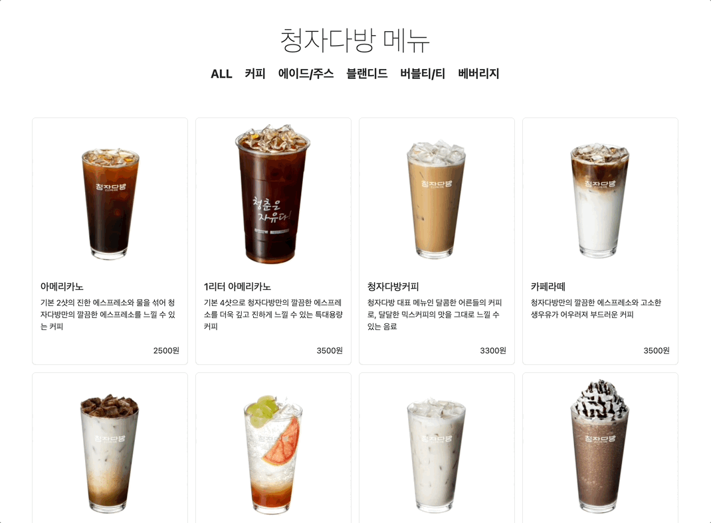

# 음식 메뉴 앱



### 기능 개요

스타일: Bootstrap v5.3 CDN  
참고 메뉴판: [청자다방](https://www.cheongjadabang.com/)

**1. 카테고리 버튼 생성**

- 카테고리 버튼들이 한 그룹으로 모여 사용자에게 카테고리별로 메뉴를 볼 수 있는 기능 제공
- 각 버튼의 id는 해당 메뉴의 카테고리와 일치하도록 설정

**2. 카테고리별 필터링 기능 구현**

- 사용자가 특정 카테고리 버튼을 클릭하면 해당 카테고리에 속하는 메뉴만 화면에 표시
- 카테고리 버튼 클릭 이벤트는 이벤트 위임(Event Delegation) 방식을 사용해 효율적인 이벤트 처리를 구현

**3. 메뉴 리스트 생성 및 동적 출력**

- 메뉴 아이템은 Bootstrap의 카드 레이아웃을 사용하여 그리드 형태로 출력
- 메뉴 데이터를 바탕으로 각 메뉴의 이미지, 이름, 가격, 상세 설명이 동적으로 생성됨

### 구현 세부사항

**1. 카테고리 버튼 생성 및 이벤트 등록**

1.  `categorys` 클래스를 포함한 `<div>` 요소 내에 버튼들이 배치, 각 버튼에 카테고리별 ID 설정

    ```html
    <div class="categorys d-flex justify-content-center flex-wrap">
      <button type="button" id="all" class="btn">ALL</button>
      <button type="button" id="coffee" class="btn">커피</button>
      <button type="button" id="ade" class="btn">에이드/주스</button>
      ...
    </div>
    ```

2.  버튼 클릭 시 해당 카테고리에 맞는 메뉴를 필터링하여 표시
    ```javascript
    const categoryButtons = document.querySelector(".categorys");
    categoryButtons.addEventListener("click", (event) => {
      if (event.target.type !== "button") return; // 버튼 외 요소 무시
      if (event.target.id === "all") {
        createMenuItems(menus); // 모든 메뉴 표시
      } else {
        createMenuItems(
          menus.filter((item) => item.category === event.target.id)
        ); // 카테고리별 메뉴 표시
      }
    });
    ```

**2. 메뉴 리스트 동적 생성**

1.  메뉴 정보는 JavaScript 객체 배열로 관리, 각 메뉴 항목을 Bootstrap 카드 형태로 출력

    ```javascript
    const createMenuItems = (menus) => {
      const menuList = document.querySelector(".menu-list");
      menuList.innerHTML = ""; // 이전 메뉴 리스트 지우기

      for (const menu of menus) {
        const col = document.createElement("div");
        col.setAttribute("class", "col");

        const card = document.createElement("div");
        card.setAttribute("class", "card");

        const img = document.createElement("img");
        img.setAttribute("src", menu.img);
        img.setAttribute("class", "card-img-top");
        img.setAttribute("alt", menu.title);

        const cardBody = document.createElement("div");
        cardBody.setAttribute("class", "card-body");

        const title = document.createElement("h5");
        title.setAttribute("class", "card-title");

        title.innerText = menu.title;

        const desc = document.createElement("p");
        desc.setAttribute("class", "card-text");
        desc.innerText = menu.desc;

        const price = document.createElement("div");
        price.setAttribute(
          "class",
          "d-flex justify-content-end align-items-right"
        );
        price.innerText = menu.price;

        menuList.appendChild(col).appendChild(card).appendChild(img);
        card.appendChild(cardBody);
        cardBody.append(title, desc, price);
      }
    };
    ```

**3. 초기 메뉴 출력**

1.  페이지가 로드되면 모든 메뉴가 표시되도록 `window.onload` 이벤트를 활용해 초기 메뉴를 출력
    ```javascript
    window.onload = function () {
      createMenuItems(menus);
    };
    ```
