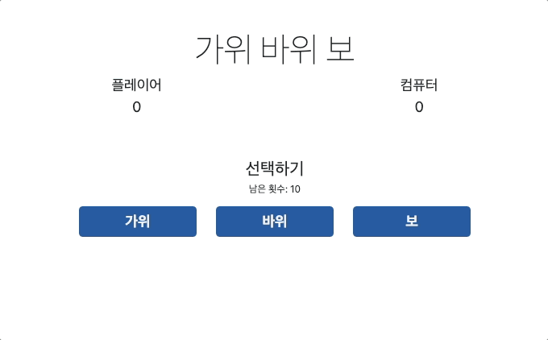

# 가위 바위 보 앱



### 기능 개요

스타일: Bootstrap v5.3 CDN

**컴퓨터와 가위 바위 보 게임**

- 컴퓨터는 랜덤하게 가위, 바위, 보 중 하나를 선택한다.
- 사용자는 가위, 바위, 보 버튼을 클릭하여 컴퓨터와 대결한다.
- 승패 결정:
  - 사용자가 이기면 사용자 점수가 증가하고, 컴퓨터가 이기면 컴퓨터 점수가 증가한다.
  - 화면 하단에 누가 이겼는지 결과가 출력된다.
- 총 10번의 대결:
  - 10번의 게임이 끝나면 결과를 출력하고 게임이 종료된다.
  - 종료 후에는 "다시 시작" 버튼이 생성되고, 이를 클릭하면 게임이 초기화한다.

### 구현 세부사항

**1. 가위 바위 보 버튼 생성 및 이벤트 등록**

1.  `game-btn` 클래스를 가진 `<div>` 요소 내에 가위 바위 보 버튼 배치, 각 버튼에 고유 ID 설정

    ```html
    <div class="game-btn d-flex justify-content-between flex-wrap">
      <button type="button" id="0" class="btn">가위</button>
      <button type="button" id="1" class="btn">바위</button>
      <button type="button" id="2" class="btn">보</button>
    </div>
    ```

2.  클릭 이벤트 등록, 버튼 클릭 시 컴퓨터는 난수(0: 가위, 1: 바위, 2: 보)를 통해 선택하며, 사용자와 컴퓨터의 선택을 비교하여 승패를 결정한다.

    ```javascript
    const gameButtons = document.querySelector(".game-btn");
    gameButtons.addEventListener("click", (event) => {
      if (event.target.type !== "button") return; // ignore non-button clicks
      const computer = Math.floor(Math.random() \* 3); // 0: 가위 1: 바위 2: 보
      const player = parseInt(event.target.id);

      let resultMessage = "";

      if (computer == player) {
        // 비기는 경우
        resultMessage = "무승부";
      } else if ((player + 1) % 3 == computer) {
        // 지는 경우
        resultMessage = "컴퓨터 승리";
        computerScore++;
        computerScoreEl.innerText = computerScore;
      } else {
        // 이기는 경우
        resultMessage = "플레이어 승리";
        playerScore++;
        playerScoreEl.innerText = playerScore;
      }

      resultMessgeEl.innerText = resultMessage;
      round--;
      roundEl.innerText = round;

      if (round === 0) {
        // 모든 라운드 종료
        gameDone();
      }
    });
    ```

**2. 게임이 끝났을 때 초기화 및 재시작**

- 게임 종료 처리:

  10번의 게임이 끝나면 게임 결과를 요약하여 표시하고 승패 결과에 따라 "플레이어 승리", "컴퓨터 승리", "무승부"를 출력한다.

  ```javascript
  function gameDone() {
    gameIngEl.style.display = "none"; // 게임 중 화면 숨기기
    resultMessgeEl.innerText = ""; // 게임 중 결과 초기화

    // 최종 결과 표시
    const result =
      playerScore > computerScore
        ? "게임에서 이겼습니다!"
        : playerScore < computerScore
        ? "게임에서 졌습니다."
        : "무승부!";
    finalMessageEl.innerText = result;

    gameDoneEl.style.display = "block"; // 게임 종료 화면 표시
  }
  ```

- 재시작 처리:

  게임이 종료된 후 "다시 시작" 버튼을 클릭하면, 점수와 횟수를 초기화하고 새로운 게임을 시작한다.

  ```javascript
  restartBtnEl.addEventListener("click", () => {
    playerScore = 0;
    computerScore = 0;
    round = 10;

    playerScoreEl.innerText = playerScore;
    computerScoreEl.innerText = computerScore;
    roundEl.innerText = round;

    resultMessgeEl.innerText = "";
    finalMessageEl.innerText = "";

    gameDoneEl.style.display = "none";
    gameIngEl.style.display = "block";
  });
  ```
