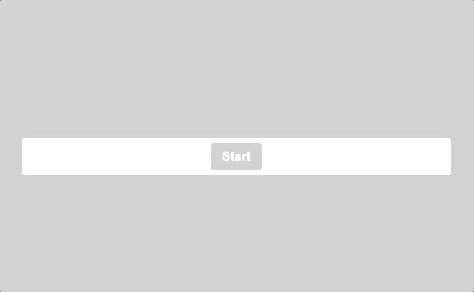

# 퀴즈 앱



**퀴즈 앱**

- 퀴즈 시작: "Start" 버튼을 눌러 퀴즈를 시작한다.
- 질문과 여러 개의 답변 버튼이 표시된다.
  - 답변을 선택하면 정답 여부에 따라 배경과 버튼 색상이 변경된다.
- "Next" 버튼을 눌러 다음 질문으로 넘어간다.
- 모든 질문을 완료하면 "Restart" 버튼이 표시되어 퀴즈를 다시 시작할 수 있다.

### 구현 세부사항

**1. 퀴즈 시작**  
사용자가 "Start" 버튼을 클릭하면 startBtn이 숨겨지고, 질문들이 sort() 함수를 통해 무작위로 섞어 첫 번째 질문이 표시된다.

```javascript
startBtn.addEventListener("click", () => {
  startBtn.classList.add("hide");
  shuffledQuestions = questions.sort(() => Math.random() - 0.5);
  currentIndex = 0;
  questionContainerEl.classList.remove("hide");
  nextQuestion();
});
```

**2. 질문 및 답변 표시**  
nextQuestion() 함수는 다음 질문을 표시한다. 이전 답변 버튼을 모두 초기화하고 현재 질문과 답변 버튼을 동적으로 업데이트한다.

```javascript
function nextQuestion() {
  resetAnsBtn(); // 이전 답변 초기화
  clearStatusClass(document.body); // 배경색 초기화
  showQuestion(shuffledQuestions[currentIndex]); // 현재 질문 표시
}

function showQuestion(question) {
  questionEl.innerText = question.question;
  question.answer.forEach((answer) => {
    const button = document.createElement("button");
    button.innerText = answer.text;
    button.classList.add("btn");
    if (answer.correct) {
      button.dataset.correct = answer.correct;
    }
    button.addEventListener("click", selectAnswer);
    answerBtn.appendChild(button);
  });
}
```

**3. 답변 선택**  
사용자가 답변을 선택하면 선택한 답변이 정답인지 오답인지 확인하고, 그에 따라 배경색과 버튼 색상이 변경된다.

```javascript
function selectAnswer(event) {
  const selectedButton = event.target;
  const correct = selectedButton.dataset.correct;
  setStatusClass(document.body, correct);
  Array.from(answerBtn.children).forEach((button) => {
    setStatusClass(button, button.dataset.correct);
  });

  if (shuffledQuestions.length > currentIndex + 1) {
    nextBtn.classList.remove("hide");
  } else {
    startBtn.innerText = "Restart";
    startBtn.classList.remove("hide");
  }
}
```

**4. 정답/오답에 따른 배경색 업데이트**  
답변을 선택했을 때, 그에 따라 배경과 버튼의 색상이 정답이면 녹색(correct), 오답이면 빨간색(wrong)으로 변경한다.

```javascript
function setStatusClass(el, correct) {
  clearStatusClass(el); // 이전 상태 초기화
  if (correct) {
    el.classList.add("correct");
  } else {
    el.classList.add("wrong");
  }
}

function clearStatusClass(el) {
  el.classList.remove("correct");
  el.classList.remove("wrong");
}
```

**5. 다음 질문으로 이동**  
사용자가 "Next" 버튼을 클릭하면 다음 질문으로 이동하며, 상태가 초기화되고 새 질문이 표시된다.

```javascript
nextBtn.addEventListener("click", () => {
  currentIndex++;
  nextQuestion();
});
```
