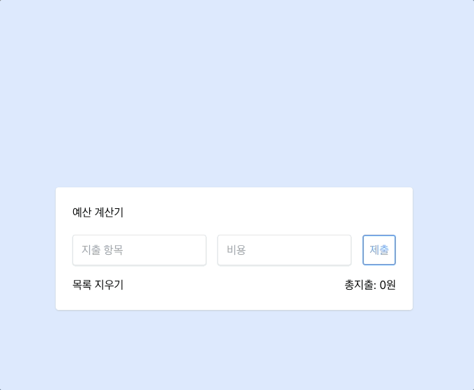

# 예산 계산기 앱

## 기능

예산 항목 추가: 사용자는 지출 항목과 비용을 입력하여 새로운 예산 항목을 추가할 수 있다.
예산 항목 수정: 기존의 예산 항목을 선택하여 내용을 수정할 수 있다.
예산 항목 삭제: 목록에서 예산 항목을 삭제/전체 삭제할 수 있다.
총 지출 계산: 입력된 예산 항목의 총 지출을 자동으로 계산하여 표시한다.
토스트 메시지: 항목이 추가, 수정, 삭제될 때마다 사용자에게 알림 메시지를 표시한다.
